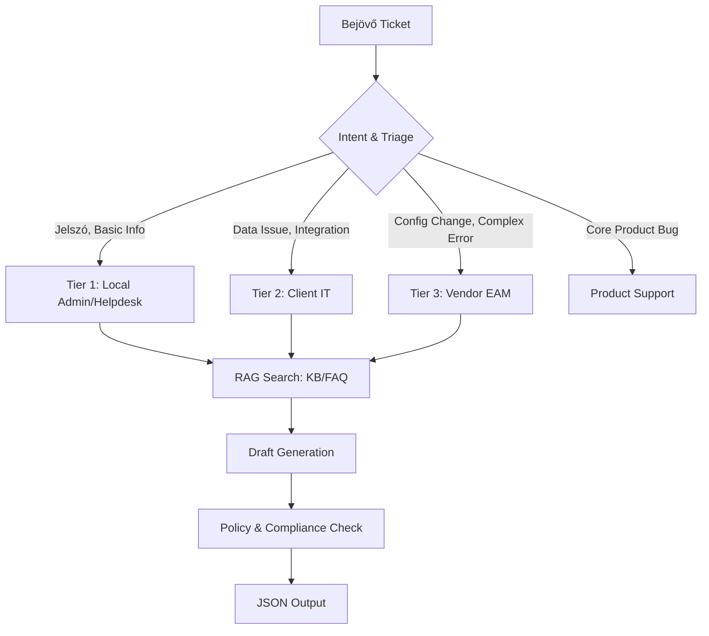

# 2. AI Support Triage & Answer Drafting Agent miniprojct

## Medical Support Triage & Answer Drafting Agent

**Projekt név:** MedicalSupportAI (Pharma CRM Triage)
**Alcím:** Ügyfélszolgálati Triage és Válaszoló Agent Orvosi/Gyógyszeripari Környezetben

### Koncepció

Egy specializált AI agent, amely a szigorúan szabályozott orvosi/gyógyszeripari szoftvertámogatás (pl. Medical CRM, Content Approval System) területén lát el elsőszintű kategorizálási és válaszadási feladatokat.

A rendszer legfőbb feladata a bejövő hibajegyek pontos besorolása a **4 szintű támogatási modell (Tier 1-3 + Product Support)** alapján, valamint policy-konform válaszok előkészítése.

### Támogatási Szintek és Definíciók (Scope)

Az AI-nak az alábbi logika alapján kell kategorizálnia (Triage):

| Szint | Definíció & Scope | Felelős (Responsible) |
| :--- | :--- | :--- |
| **Tier 1 Support** | **Alapvető hibaelhárítás.**  - "Hogyan működik?" kérdések - Jelszó/Belépési problémák - Alapvető hibakeresés (troubleshooting) - Rutin kérések (pl. access request) | - 3rd Party Service Provider- Client Local Admin- Vendor GSC* |
| **Tier 2 Support** | **Haladó technikai támogatás.** - L1 által eszkalált ügyek - Felület/Applikáció mélyebb vizsgálata - User management komplexebb kérdések - Adatproblémák (Data issues) - Integrációs hibák diagnosztizálása | - 3rd Party Service Provider- Client IT |
| **Tier 3 Support** | **Szakértői mérnöki támogatás.** - Kritikus és komplex problémák, melyeket L2 nem tudott megoldani - Gyökérok elemzés (Root Cause Analysis) - Konfigurációs vagy testreszabási változtatások - Technikai dokumentáció karbantartása | - Vendor EAM (Enterprise Account Management) |
| **Vendor Product Support** | **Termék szintű hibák.** - Szoftver bugok (Product bugs) - Együttműködés az EAM L3-mal - Nem végeznek változtatást az ügyfél adatain vagy konfigurációján | - Vendor Product Support |

### A Termék Működése

**Input:** Bejövő üzenet (email/ticket) + Metadata (User role, System info)

**Workflow:**



### JSON Output Specifikáció

A kimenetnek tartalmaznia kell a deduktív triage döntés indoklását és a felelős csapatot.

```json
{
  "ticket_id": "INC-2025-001",
  "analysis": {
    "summary": "User unable to see 'Submit' button on Call Report page.",
    "intent": "Technical Issue / UI Behavior",
    "complexity": "Medium"
  },
  "triage_decision": {
    "support_tier": "Tier 2 Support",
    "responsible_party": "Client IT / 3rd Party Provider",
    "reasoning": "A probléma specifikus felület/applikáció viselkedést érint (interface issue), de nem tűnik globális bugnak első ránézésre. Mélyebb vizsgálatot (diagnostics) igényel, ami a Tier 2 scope-ja.",
    "escalation_needed": false
  },
  "answer_draft": {
    "recipient": "Dr. Kovács (User)",
    "body": "Kedves Felhasználó, köszönjük megkeresését. A 'Submit' gomb hiánya gyakran jogosultsági beállításokhoz vagy szinkronizációs hibához köthető. [KB-Access-Rules]\n\nKérjük, próbálja meg a következőket:\n1. Mobilalkalmazás szinkronizáció manuális indítása.\n2. Ellenőrizze, hogy a hívás státusza 'Planned' vagy 'Saved'.\n\nJegyét továbbítottuk a Tier 2-es támogató csapatnak (Client IT) további kivizsgálásra.",
    "citations": ["KB-Access-Rules", "Guide-Call-Reporting"]
  }
}
```

### Technikai Stack és Követelmények

1. **AI Model (Google Stack)**:
    - **Foundation Model**: `Google Gemini 3 Flash` a komplex orvosi triage és válaszgenerálás feladataihoz.
    - **RAG & Embeddings**: `Google Text Embedding 004` (Vertex AI) a tudásbázis (KB/FAQ) kereséséhez.
    - **Framework**: `LangChain` vagy `LangGraph` a `langchain-google-genai` csomaggal.
2. **Medical Context Awareness**: Az LLM-nek ismernie kell a fogalmakat (pl. Sample management, Call reporting, CLM, Document Management).
3. **Audit Trail & Monitoring**: Minden döntés (miért Tier 2?) naplózandó `Google Cloud Logging` és `Vertex AI Model Monitoring` segítségével.
4. **Biztonság & Compliance**: 
    - **PII Protection**: `Google Cloud DLP API` (Data Loss Prevention) a személyes adatok detektálására és maszkolására a bemeneten.
    - **Compliance**: Pharma/Medical policy-konform válaszok validálása.


``

### LangGraph Workflow

```
┌─────────────────┐
│  Ticket Input   │
└────────┬────────┘
         │
         ▼
┌─────────────────┐
│ Intent Detection│  (LLM - category + sentiment)
└────────┬────────┘
         │
         ▼
┌─────────────────┐
│ Triage Node     │  (LLM - priority + SLA)
└────────┬────────┘
         │
         ▼
┌─────────────────┐
│ Query Expansion │  (LLM - search queries)
└────────┬────────┘
         │
         ▼
┌─────────────────┐
│ Vector Search   │  (Embeddings + Retrieval)
└────────┬────────┘
         │
         ▼
┌─────────────────┐
│   Re-ranking    │  (Cross-encoder / LLM)
└────────┬────────┘
         │
         ▼
┌─────────────────┐
│ Draft Generator │  (LLM + Template)
└────────┬────────┘
         │
         ▼
┌─────────────────┐
│  Policy Check   │  (Guardrails)
└────────┬────────┘
         │
         ▼
┌─────────────────┐
│  JSON Output    │  (Structured + Citations)
└─────────────────┘
```

### Technikai Stack

**Backend:**
- Python 3.11+
- FastAPI with type hints
- LangChain + LangGraph
- Vector DB: Qdrant
- Embeddings: Google Text Embedding 004 (Vertex AI)
- LLM: Google Gemini 3 Flash 
- Re-ranker: Vertex AI Ranking API / LLM-based

**Frontend (opcionális):**
- React dashboard (triage review)
- Real-time draft preview
- Citation highlight

**Integrations:**
- Email (IMAP/SMTP)
- Zendesk / Freshdesk API
- Slack / Teams webhook
- Jira Service Desk

## 🏗️ SOLID Principles Applied

### Single Responsibility Principle (SRP)
- Each class/module has **one clear purpose**
- `FileUserRepository`: Only handles user profile persistence
- `WeatherTool`: Only handles weather API calls
- `ChatService`: Only orchestrates chat workflow

### Open/Closed Principle (OCP)
- **Easy to add new tools** without modifying existing code
- New tool: Implement `IToolClient`, create wrapper in `tools.py`, register in `agent.py`
- **No changes needed** to agent core logic or graph structure

### Liskov Substitution Principle (LSP)
- All tool clients implement `IToolClient` interface
- Can be swapped without breaking agent functionality
- Mock implementations for testing

### Interface Segregation Principle (ISP)
- **Specific interfaces** for different concerns:
  - `IUserRepository`: User profile operations
  - `IConversationRepository`: Conversation operations
  - `IWeatherClient`, `IFXRatesClient`, etc.: Specific tool operations
- Clients only depend on methods they use

### Dependency Inversion Principle (DIP)
- High-level modules (`ChatService`, `AIAgent`) depend on **abstractions** (`IUserRepository`, `IToolClient`)
- Low-level modules (repositories, API clients) implement abstractions
- **Easy to swap implementations** (file storage → database, real APIs → mocks)

## 🏛️ Architecture

### Backend Structure

```
backend/
├── domain/                 # Domain layer - Core business entities
│   ├── models.py          # Data models (Message, UserProfile, Memory, etc.)
│   └── interfaces.py      # Abstract interfaces (IUserRepository, IToolClient, etc.)
├── infrastructure/        # Infrastructure layer - External implementations
│   ├── repositories.py    # File-based persistence (user profiles, conversations)
│   └── tool_clients.py    # External API clients 
├── services/              # Service layer - Business logic
│   ├── agent.py           # LangGraph agent implementation
│   ├── tools.py           # Tool wrappers for agent
│   └── chat_service.py    # Chat workflow orchestration
└── main.py               # API layer - FastAPI endpoints

**Behavior**:
- ✅ All messages (user, assistant, system, tool) are persisted
- ✅ Can be cleared with "reset context" command
- ✅ User profile remains intact after reset
```

### Frontend Structure

```
frontend/
├── src/
│   ├── components/
│   │   ├── ChatWindow.tsx      # Scrollable message list
│   │   ├── MessageBubble.tsx   # Individual message display
│   │   ├── ChatInput.tsx       # User input field
│   │   └── DebugPanel.tsx      # Tools & memory viewer
│   ├── App.tsx                 # Main application
│   ├── api.ts                  # Backend API client
│   ├── types.ts                # TypeScript interfaces
│   └── utils.ts                # Utility functions
├── index.html
├── vite.config.ts
└── package.json
```

### Mérési Metrikák

| Metrika | Cél |
| :--- | :--- |
| **First Contact Resolution (FCR)** | Tier 1 kérdések 60%-a automatikus választ kapjon |
| **Triage Accuracy** | 95% pontosság a Tier 1-3 besorolásban |
| **Escalation Reduction** | Helytelenül Tier 3-ra küldött jegyek számának 40%-os csökkentése |

---

You are an expert Python backend engineer and software architect.
Generate above detailed projects, both frontend and backend. The frontend is a React application and the backend is a Python FastAPI application.
The frontend should be a chat application that can chat with the backend to create issue tickets
The backend should be a chatbot that can answer questions and provide information.

The code MUST follow SOLID principles (Single Responsibility, Open/Closed, Liskov, Interface Segregation, Dependency Inversion) in a pragmatic, lightweight way. Use small, focused classes and clear abstractions.

-----------
- Based on an official Python image (e.g. `python:3.11-slim`).
- Copy the project files into the container.
- Install dependencies from `requirements.txt`.
- Use a working directory like `/app`.
- Ensure the `./qdrant_db` directory is created and writable.
- Set `ENTRYPOINT` or `CMD` so that running the container starts the CLI, e.g.:
    `CMD ["python", "-m", "app.main"]`

Developer instructions
-----------------------
Add short usage instructions as comments (or docstring) in `app/main.py`:

- How to copy `.env.example` to `.env` and fill in the necessary values.
- How to build the Docker image, e.g.:
    - `docker build -t ai-agent-demo .`
- How to run the container with the env file:
    - `docker run -it --env-file .env ai-agent-demo`

Code style
-----------
- Use clear function boundaries and small classes that follow SOLID.
- Add type hints and minimal docstrings for public methods.
- Keep the code as simple and educational as possible: this is for teaching embeddings + vector DB basics and SOLID design in a Python/Docker setting.

Now generate all the mentioned files with full, working code. WORK IN THE DIRECTORY named dezsi.lajos in which create and app folder.
Within it create both the frontend and the backend.
Add instructions to the README.md file how to run the application and test the application.
